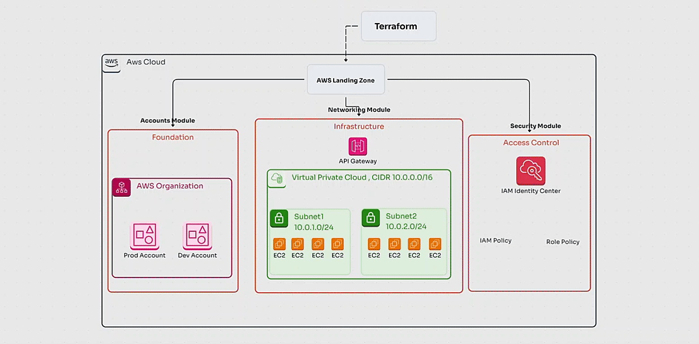

# 🌍 Simple AWS Landing Zone  with Terraform 🚀

Welcome to the **AWS Landing Zone** project! This repository automates the setup of foundational AWS resources, including multi-account management, networking, and security configurations. The project uses **Terraform** to define and provision resources, following AWS best practices for building a scalable, secure cloud environment.

---

## 📜 Table of Contents

- [Project Overview](#project-overview)
- [Folder Structure](#folder-structure)
- [Modules Breakdown](#modules-breakdown)
- [Prerequisites](#prerequisites)
- [Step-by-Step Process](#step-by-step-process)
- [Outputs](#outputs)
- [Contributing](#contributing)


---

## 🚀 Project Overview


This AWS Landing Zone project helps you set up a secure and scalable AWS environment by automating:

1. **Multi-Account Setup**: Create and manage AWS accounts using AWS Organizations.
2. **Networking Infrastructure**: Set up a Virtual Private Cloud (VPC), subnets, and security.
3. **IAM Security**: Define IAM roles and policies to manage secure access control.

---

## 📂 Folder Structure

```plaintext
aws-landing-zone/
├── main.tf
├── variables.tf
├── outputs.tf
├── modules/
│   ├── accounts/
│   │   ├── main.tf
│   │   ├── variables.tf
│   │   └── outputs.tf
│   ├── networking/
│   │   ├── main.tf
│   │   ├── variables.tf
│   │   └── outputs.tf
│   └── security/
│       ├── main.tf
│       ├── variables.tf
│       └── outputs.tf
└── terraform.tfvars
```

### Root Files:
- **`main.tf`**: Main Terraform configuration that includes the modules.
- **`variables.tf`**: Defines input variables for customization.
- **`outputs.tf`**: Displays important output values (like account IDs, VPC ID, etc.).
- **`terraform.tfvars`**: Contains specific variable values for deployment (e.g., region, account names, CIDR blocks).

---

## 🔧 Modules Breakdown

The project is structured into three core modules:

### 1️⃣ Accounts Module (Account Management)

This module automates the creation of AWS accounts within AWS Organizations.

**Inputs**: Account names, email addresses.  
**Outputs**: List of AWS account IDs.

**Files**:
- **`modules/accounts/main.tf`**: Resources for creating accounts.
- **`modules/accounts/variables.tf`**: Variables for account names and emails.
- **`modules/accounts/outputs.tf`**: Account IDs as outputs.

### 2️⃣ Networking Module (Networking Infrastructure)

Sets up the VPC, subnets, and related networking resources.

**Inputs**: VPC CIDR block, subnet CIDRs, and VPC name.  
**Outputs**: VPC ID and subnet IDs.

**Files**:
- **`modules/networking/main.tf`**: Defines VPC and subnet resources.
- **`modules/networking/variables.tf`**: Input variables for CIDR blocks.
- **`modules/networking/outputs.tf`**: Outputs VPC ID and subnet IDs.

### 3️⃣ Security Module (IAM Roles & Policies)

Manages IAM roles and security policies.

**Inputs**: Role names, policies, and trust relationship.  
**Outputs**: IAM role ARN.

**Files**:
- **`modules/security/main.tf`**: IAM roles and policies definition.
- **`modules/security/variables.tf`**: Input variables for IAM roles.
- **`modules/security/outputs.tf`**: Outputs the IAM role ARN.

---

## 🛠️ Prerequisites

Before starting, ensure you have the following installed:

- **Terraform** (v1.0.0+)
- AWS Account with permissions to manage:
  - IAM roles and policies
  - VPCs and subnets
  - AWS Organizations
- **AWS CLI** configured with the required credentials.

---

## 📝 Step-by-Step Process

### 1. Clone the Repository

Clone this repository to your local machine:

```bash
git clone https://github.com/yassinmidouni/Simple-AWS-Landing-Zone.git
cd aws-landing-zone
```

### 2. Initialize Terraform

Run the following command to initialize Terraform and download the necessary providers:

```bash
terraform init
```

### 3. Customize Your Configuration

Edit the `terraform.tfvars` file to set values for:

- **AWS Region**: Modify if you prefer a region other than `us-east-1`.
- **Account Names and Emails**: Set the names and emails for the accounts you want to create.
- **VPC CIDR and Subnet CIDRs**: Define your desired network configurations.
- **IAM Role Names and Policies**: Specify your IAM roles.

### 4. Generate and Review the Execution Plan

Before applying the configuration, run `terraform plan` to generate an execution plan. This command allows you to preview the changes Terraform will make to your infrastructure [Terraform_plan.tf](Terraform_plan.tf):

```bash
terraform plan
```

### 5. Apply the Configuration

Run the following command to apply the Terraform configuration and provision the resources:

```bash
terraform apply
```

Review the execution plan, then type `yes` to confirm and create the resources.

---

## 📊 Outputs

After Terraform applies the configuration, you will see the following output:

- **Account IDs**: The IDs of the AWS accounts created.
- **VPC ID**: The ID of the VPC.
- **Subnet IDs**: The IDs of the subnets created.
- **IAM Role ARN**: The ARN of the IAM role.

---

## 🤝 Contributing

We welcome contributions! If you'd like to contribute:

1. Fork the repository.
2. Create a feature branch.
3. Commit your changes.
4. Submit a pull request.

Please ensure your code adheres to the existing style and is well-tested.

---

